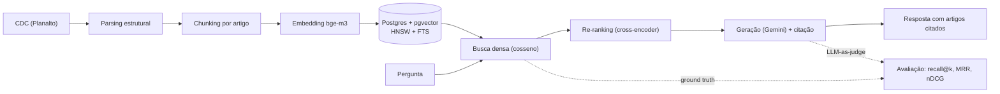

# RAG sobre o Código de Defesa do Consumidor

Sistema de **RAG (Retrieval-Augmented Generation)** canônico que responde perguntas em linguagem
natural sobre o **Código de Defesa do Consumidor** (Lei 8.078/1990) **citando o artigo** que
fundamenta a resposta — e que **mede**, com métricas objetivas, a qualidade da recuperação e da
geração.

Projeto de estudo e portfólio: RAG construído do zero (chunking, embeddings, busca vetorial,
re-ranking, avaliação), em stack open-source e **custo zero**. O foco não é só "funcionar" — é
**justificar cada decisão de arquitetura** e **comprovar por experimento** o efeito de cada peça.

> _README em português. Uma versão em inglês pode ser adicionada depois._

---

## Exemplo

```
$ python scripts/ask.py "posso desistir de uma compra feita pela internet?"

Resposta: Sim. O consumidor pode desistir da compra no prazo de 7 dias a contar do
recebimento, quando a contratação ocorre fora do estabelecimento comercial — como nas
compras pela internet. Os valores pagos são devolvidos, monetariamente atualizados (Art. 49).

Artigos citados: Art. 49
Recuperados (top-5): art_49, art_35, art_18, art_54G, art_41
```

A pergunta não contém as palavras "arrependimento" nem "artigo 49" — o artigo correto é
encontrado por **similaridade semântica**, não por casamento de palavras.

---

## Por que este projeto

O objetivo foi dominar o **RAG canônico** — com etapa de **busca semântica seletiva** (recuperar
só os trechos relevantes) — em vez de *full context injection* (jogar todo o corpus no prompt).
A legislação foi escolhida de propósito: o texto legal tem **estrutura hierárquica nativa**
(lei → artigo → parágrafo → inciso), o que traz duas vantagens de engenharia:

1. **Chunking não-arbitrário:** a unidade semântica do domínio é o artigo, então o *chunk* é o
   artigo — não uma janela fixa de N tokens.
2. **Avaliação objetiva:** cada artigo tem um ID, então o *ground truth* de "qual artigo responde
   a esta pergunta" é factual e mensurável.

---

## Arquitetura



### Decisões de arquitetura

| Camada | Escolha | Racional |
|---|---|---|
| **Chunking** | Estrutural por artigo | A unidade semântica do domínio é o artigo; evita cortar uma norma ao meio. Metadados: lei, nº, §, inciso. |
| **Embedding** | `BAAI/bge-m3` (dense, 1024-d) | Encoder denso multilíngue treinado para *retrieval*, PT-BR forte, contexto longo (8k). Open-source, roda em CPU. Plugável via config. |
| **Vector store** | Postgres + `pgvector` (HNSW) | Vetor como "mais uma coluna" (índice HNSW / cosseno); zero custo; e habilita busca híbrida (FTS `portuguese`) sem serviço extra. |
| **Retrieval** | Denso (cosseno) → re-ranking | Duas etapas: bi-encoder recupera rápido, cross-encoder reordena com precisão. |
| **Re-ranking** | `BAAI/bge-reranker-v2-m3` | Cross-encoder lê o par (pergunta, artigo) junto — recupera nuances que o embedding diluído perde. Ganho **comprovado por experimento** (abaixo). |
| **Geração** | Gemini + saída estruturada | *System instruction* anti-alucinação (responde só com base no contexto), citação verificável (JSON), `temperature=0`. |
| **Avaliação** | Métricas à mão + LLM-as-judge | Recuperação: recall@k, MRR, nDCG. Geração: acurácia de citação (objetiva) + *groundedness* (Gemini-juiz). |

---

## Resultados da avaliação

### Recuperação

Avaliação de **recuperação** sobre um *dataset* de 18 perguntas em linguagem leiga, com ground
truth por artigo (`evalset/questions.jsonl`). Comparação **busca densa** vs **densa + re-ranking**:

| métrica | densa | densa + rerank |
|---|---:|---:|
| Hit@1 | 0,833 | **0,944** |
| Hit@3 | 0,944 | **1,000** |
| Recall@5 | 0,944 | **1,000** |
| nDCG@10 | 0,923 | **0,979** |
| MRR | 0,898 | **0,972** |

**Leitura:** a busca densa já é forte (o artigo certo vem em 1º em 83% dos casos). O re-ranking
eleva o MRR de 0,898 → 0,972 **sem nenhuma regressão** e conserta os casos difíceis — em especial
uma pergunta sobre *venda casada*, cujo artigo (um artigo-lista longo, que dilui o embedding) subiu
da 6ª para a 2ª posição. O resíduo desse caso motiva o próximo experimento (busca híbrida lexical).

### Geração

Avaliação da resposta gerada (`scripts/evaluate_generation.py`), em amostra de 8 perguntas
(limite do *free tier* do Gemini):

| métrica | resultado |
|---|---:|
| Acurácia de citação (cita o artigo correto) | **8/8 = 100%** |
| Groundedness média (fidelidade ao contexto, via Gemini-as-judge) | **1,00** |

Na amostra, a resposta citou o artigo correto em todas as perguntas e o juiz não detectou
alucinação — coerente com a *system instruction* que prende a resposta ao contexto recuperado.
**Ressalva metodológica:** a amostra é pequena e o *LLM-as-judge* é um proxy (não verdade
absoluta); uma avaliação mais robusta pediria amostra maior e revisão humana de parte dos
julgamentos.

---

## Como rodar

Pré-requisitos: Python 3.11+, PostgreSQL 16+ com a extensão **pgvector**, e uma chave gratuita do
Gemini ([Google AI Studio](https://aistudio.google.com/apikey)).

```bash
# 1. Postgres + pgvector (exemplo com Homebrew no macOS)
brew install postgresql@17 pgvector
brew services start postgresql@17
psql -d postgres -c "CREATE ROLE rag LOGIN PASSWORD 'rag' SUPERUSER;" -c "CREATE DATABASE rag OWNER rag;"
psql -d rag -c "CREATE EXTENSION IF NOT EXISTS vector;"
psql -d rag -f db/schema.sql

# 2. Ambiente Python
python -m venv .venv && source .venv/bin/activate
pip install -e .

# 3. Config
cp .env.example .env      # preencha GEMINI_API_KEY

# 4. Pipeline
python scripts/ingest.py       # baixa e faz parsing estrutural do CDC
python scripts/index.py        # gera embeddings e indexa no pgvector
python scripts/ask.py "posso cancelar uma compra feita online?"
python scripts/evaluate.py     # avaliação de recuperação (densa vs rerank)
```

> Alternativa em container: o `docker-compose.yml` sobe o Postgres+pgvector já com a extensão
> habilitada (`docker compose up -d`), para quem preferir não instalar o Postgres nativamente.

---

## Estrutura

```
src/rag/
├── ingest/       # download + parsing estrutural do CDC
├── chunking/     # chunk por artigo + metadados
├── embeddings/   # bge-m3 (interface plugável)
├── store/        # pgvector + FTS
├── retrieval/    # busca densa, rerank, duas etapas
├── generation/   # Gemini + citação estruturada
└── eval/         # métricas (recall@k/MRR/nDCG) + LLM-as-judge
scripts/          # ingest, index, ask, evaluate, evaluate_generation
evalset/          # dataset de avaliação (ground truth)
db/schema.sql     # tabela + índices HNSW/GIN
```

---

## Status

- [x] Ingestão + chunking estrutural do CDC
- [x] Embeddings (bge-m3) + indexação no pgvector (HNSW + FTS)
- [x] Busca densa + geração com citação (Gemini)
- [x] Avaliação de recuperação (recall@k / MRR / nDCG) + eval-set
- [x] Re-ranking (cross-encoder) + experimento comparativo
- [x] Avaliação de geração (citação + groundedness): amostra N=8 → citação 100%, groundedness 1,00
- [ ] Busca híbrida lexical (denso + FTS via RRF) — experimento futuro

## Custo

Roda inteiro em **free tier / custo zero**: embeddings e reranker open-source em CPU, Postgres
local, geração no *free tier* do Gemini.

## Licença

MIT.

---

Desenvolvido por **Greyce Dourado** — Analista de Dados Sênior.
[LinkedIn](https://www.linkedin.com/in/greyce-dourado) · [GitHub](https://github.com/Greyce-Dourado)
